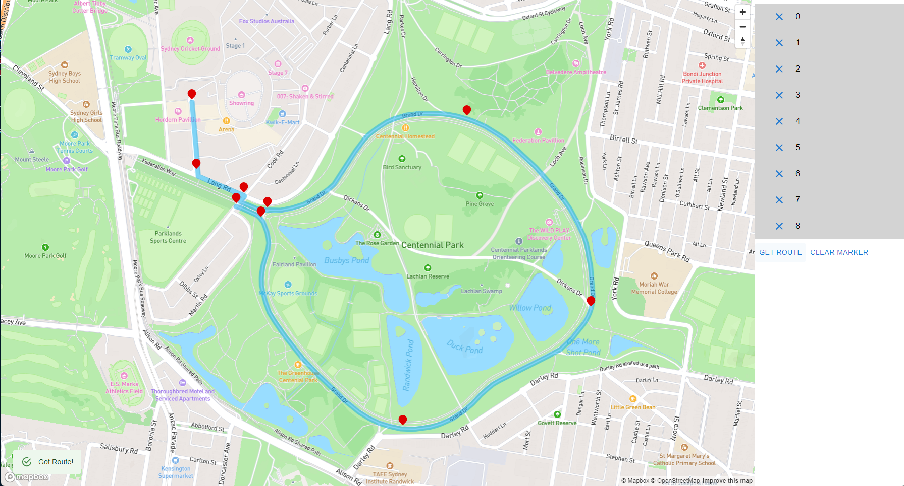

# Rally Router
A simple route planning and event management for car rallys.

## Components
This application is made of two parts, the main planner webapp used for all configuration and planning of events, and the Agent application, used by participants of the application

### Planner 
Using for planning and configuring all parts of a rally route. This includes routes, cars and people.

#### Tech stack
* React JS
* Vite build framework
* Material UI 5
* Mapbox


#### Development
All of the following steps assumes your terminal is one level deeper than this file, and in the `rallyrouter` folder. 

1. Add an envionment file. Create a file `.env` in the `rallyrouter` folder and fill the mapbox access token. The `.env` file should look like the following.
```conf
VITE_MAPBOX_TOKEN=<your private key here>
```


2. Start the development server
```bash
npm run dev
```

Below shows a sample of building a route



### Agent 
Used for following routes and keeping up with what is planned for the day

Tech stack
* TBC

